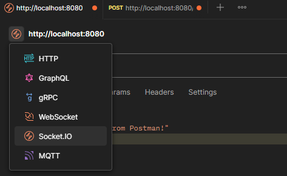
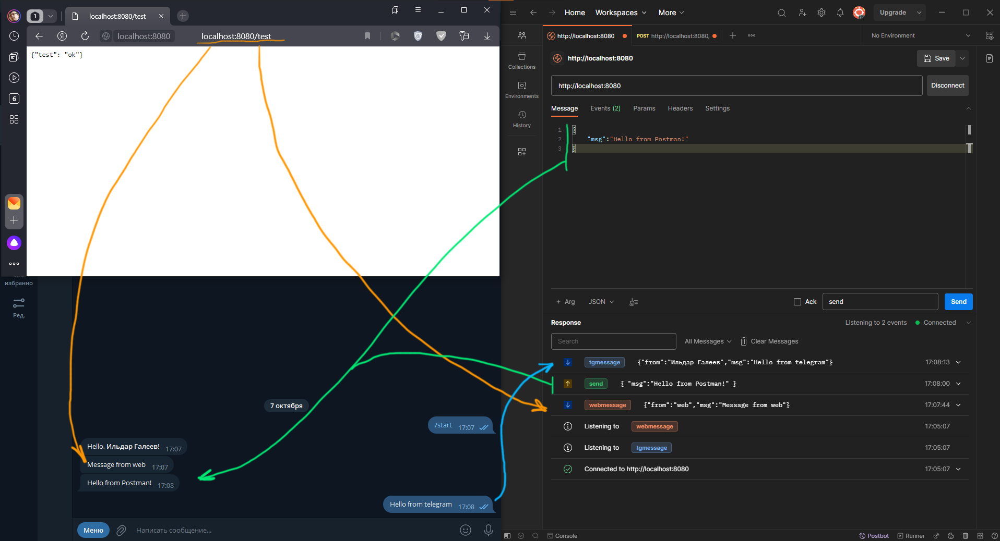

# Шаблон-пример web-приложения на `asyncio`

- http endpoints
- Telegram-бот (web-hook)
- Socket.io
- Логирование

## Функционал примера


## Переменные окружения

|                     имя | описание                                                                       |
|------------------------:|:-------------------------------------------------------------------------------|
|      APP_LOCAL_HOSTNAME | Локальное имя (серый ip)                                                       |
|          APP_LOCAL_PORT | Локальный порт                                                                 |
|     APP_GLOBAL_HOSTNAME | Глобальное имя (белый ip) для доступа из интернета (используется для web-hook) |
|      TELEGRAM_BOT_TOKEN | Telegram - токен                                                               |

## Kickstart

### 1. настроить туннель или поднять обратный прокси с настроенным HTTPS
На примере тоннеля от [ngrock](https://ngrok.com/):

1. Зарегистрироваться на ngrock
2. Скачать клиент для вашей ОС
3. Скопировать токен из раздела `Your Authtoken` в вашем аккаунте
4. Добавить токен в клиент

    ```bash
    ngrok config add-authtoken <ТОКЕН_ИЗ_АККАУНТА>
    ```
5. Запустить клиент
   ```bash
   ngrok http <APP_LOCAL_HOSTNAME>:<APP_LOCAL_PORT>
   ```
   Должны увидеть в терминале следующее:
   ```
   Session Status                online                                                                                    
   Account                       <ВАШ_АККАУНТ> (Plan: Free)
   Version                       3.3.5                                                                                     
   Region                        <РЕГИОН_ВЫДАННОГО_ВАМ_СЕРВЕРА>                                                                               
   Latency                       <ЗАДЕРЖКА>ms
   Web Interface                 <АДРЕС_ВЕБ_ИНТЕРФЕЙСА_ДЛЯ_УПРАВЛЕНИЯ>                                                                 
   Forwarding                    <ВЫДАННЫЙ_ВАМ_HOSTNAME> -> http://<APP_LOCAL_HOSTNAME>:<APP_LOCAL_PORT>
   ```
6. Нас интересует значение `ВЫДАННЫЙ_ВАМ_HOSTNAME` которое нам нужно скопировать в переменную окружения `APP_GLOBAL_HOSTNAME`

### 2. Получить токен Telegram

1. В Telegram перейти к боту [BotFather](https://t.me/BotFather)
2. Выполнить `/newbot`
   1. Дайте боту имя
   2. Назначьте username боту (без пробелов, должно оканчиваться на `_bot`)
3. Выполнить `/mybots`
   1. Выведется список ваших ботов, нажмите на только что созданного
   2. Нажмите `API Token` отобразится ваш токен
   3. Нажмите на токен - он автоматически поместится в буфер обмена
   4. Поместите скопированное значение в переменную окружения `TELEGRAM_BOT_TOKEN`

### 3. Теперь можно запустить наше приложение

После того как в терминале появится сообщение:

```
==== Running on http://..... ====
(Press CTRL+C to quit)
```

Мы можем отправить нашему боту из Telegram команду `/start`. В ответ должны получить сообщение с приветствием,
а сервер подпишет нас на получение сообщений

Воспользуемся [Postman](https://www.postman.com/downloads/) для просмотра сообщений Socket.io

В Postman нужно выбрать `Socket.io` в качестве типа запросов



Теперь нужно указать адрес и порт нашего сервера и нажать `Connect`

На вкладке `Events` нужно подписаться на два события: `tgmessage` и `webmessage`
На вкладке `Message` внизу под текстовым полем укажем тип сообщений `json`,
а само поле заполним json вида:

```json
{
    "msg":"Hello from Postman!"
}
```
Внизу рядом с кнопкой `Send` укажем имя события: `send` и нажмем на кнопку.
Если все проделано верно в Telegram придет сообщение с текстом, которое мы указали в json

Для проверки web запросов воспользуемся браузером, либо так же `Postman` (тогда мы сможем указать
тип запроса как `POST` и во вкладке `Body`, выбрав `Raw` и указав тип данных `Json` отправить свое сообщение - 
json имеет тот же формат, что мы использовали выше)

В браузере укажем адрес и порт нашего сервера и выполним `GET` запрос по пути `/test`, 
в Telegram должно прийти сообщение `Message from web` (либо с содержимым, указанным в json если 
использовали Postman). 

То же сообщение должно прийти в сообщениях Socket.io в Postman (если включена
подписка на события `webmessage`)

Отправим сообщение из Telegram. Если в Postman включена подписка на события `tgmessage` 
увидим его в сообщениях Socket.io


После всех манипуляций можем увидеть следующую картину:

